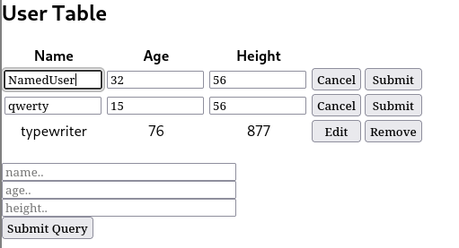
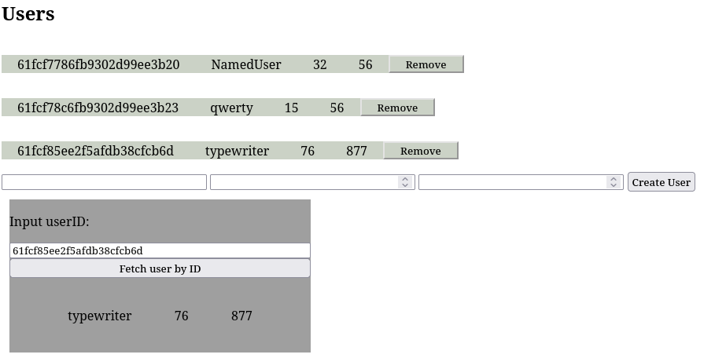

# fullstack-react-express-and-svelte

run React+Express = npm start --prefix backend & npm start --prefix control-panel

run svelte = npm run dev --prefix sveltekit-fullstack

| Tech                  | Build Size                                    | Time Spent
| -                     | -                                             | -
| React + Express       | control-panel: ~1007.2 KiB & Express: 4.5 KiB |   2-3 days
| Sveltekit fullstack   | fullstack: ~624.9 KiB                         |   7h

## React Mongodb all crud endpoints

## sveltekit Mongodb all crud endpoints except put but in this example you can search by user id

