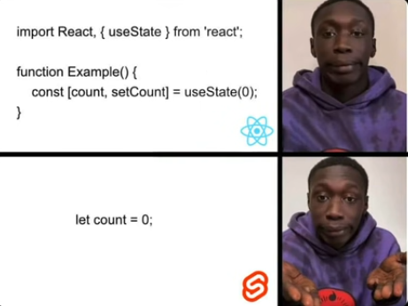

## Why i would use svelte

- a fresh take on modern web development with everything in one place
- it's more of a compiler than a framework - no virtual doms, compiles to js
- simpler, faster, leaner, easier stack and the best thing.. no boilerplate code
- first-class server-side rendering support - arguably costs less because SSR is faster, so compute reqs would be lower

## React vs Sveltekit
- React uses more cpu power, which means more electricity usage, so if you use it you want to kill turtles

<!-- 
Next steps:
  1: cd sveltekit-fullstack
  2: npm install (or pnpm install, etc)
  3: git init && git add -A && git commit -m "Initial commit" (optional)
  4: npm run dev -- --open
 -->

<!-- it behind any reserve proxy like Nginx/Caddy/etc. -->
 <!-- micro" instances, such as AppEngine or CloudFunctions) -->